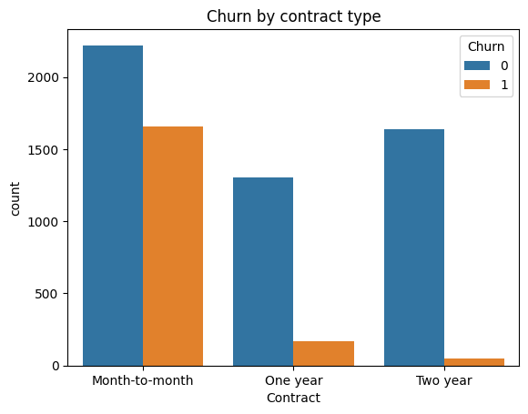
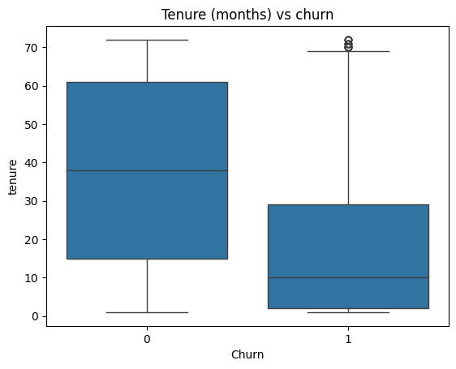
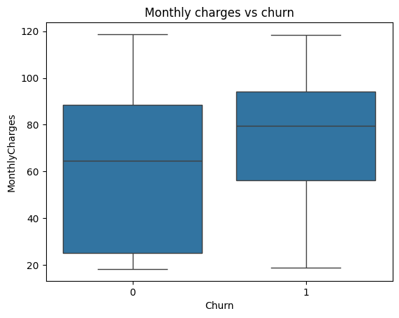
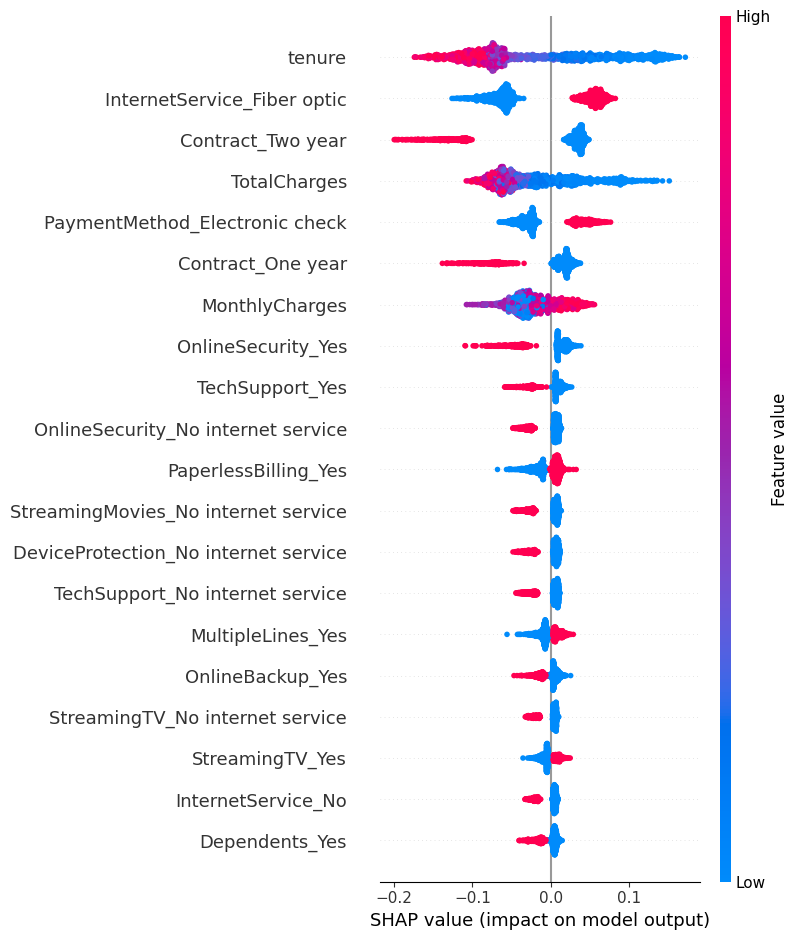

# Telco Customer Churn Prediction & Retention ROI

## Problem
Telecom companies lose revenue when customers leave. This project predicts
which customers are likely to churn, explains why, and estimates the value
of a targeted retention campaign.

## Data
[Telco Customer Churn dataset](https://www.kaggle.com/datasets/blastchar/telco-customer-churn) (7,043 customers, 21 features), not included in this repo. Download it from the link above to rerun the notebook.
After cleaning (11 rows with missing TotalCharges removed): 7,032 customers.
Overall churn rate: 26.6%.

## Approach
1. Cleaned data and encoded categorical variables
2. Exploratory analysis of churn drivers
3. Trained Logistic Regression and Random Forest (class-balanced, 80/20 split)
4. Explained predictions using SHAP
5. Estimated campaign ROI using stated assumptions

## Exploratory Findings
- Month-to-month customers account for the vast majority of churners (~1,650 vs ~170 on one-year and ~50 on two-year contracts)
- Churners have a median tenure of ~10 months, compared with ~38 months for retained customers
- Churners pay a higher median monthly bill (~€80 vs ~€65)

## Model Results
| Model | AUC | Recall (churn) | Precision (churn) |
|---|---|---|---|
| Logistic Regression | 0.835 | 0.80 | 0.49 |
| Random Forest | 0.836 | 0.75 | 0.55 |

Random Forest was selected: Logistic Regression caught slightly more churners,
but Random Forest had fewer false alarms, meaning fewer wasted retention offers.

## What Drives Churn (SHAP)

- Low tenure (new customers) is the strongest churn driver
- Fiber optic customers and electronic check payers churn more
- 1- and 2-year contracts, Online Security and Tech Support reduce churn

## Business Impact
Assumptions: €50 retention offer per customer, 30% of at-risk customers
accept and stay, 12 months of retained revenue.

| Metric | Value (test set, 1,407 customers) |
|---|---|
| Customers contacted | 511 |
| Campaign cost | €25,550 |
| Revenue saved | €74,929 |
| Net benefit | €49,379 |

These figures depend on the assumptions above and are an estimate, not a guarantee.

## Recommendations
- Offer incentives to move month-to-month customers onto annual contracts
- Build an onboarding and early-tenure retention program
- Review fiber optic service quality and pricing
- Promote Online Security and Tech Support bundles
- Encourage switching from electronic check to automatic payments

## Tools
Python, pandas, scikit-learn, SHAP, matplotlib, seaborn, Google Colab

## Author
Harshitha Shankar | MSc Business Analytics, UCD Smurfit School of Business
[LinkedIn](https://linkedin.com/in/harshithashankar14)

#machine-learning#data-analytics#churn-prediction#python#scikit-learn#shap#business-analytics#customer-analytics
